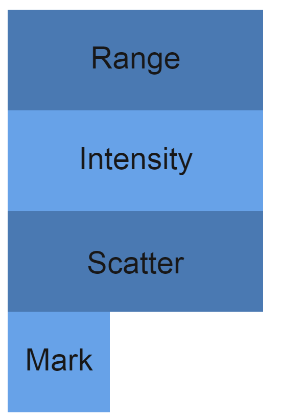
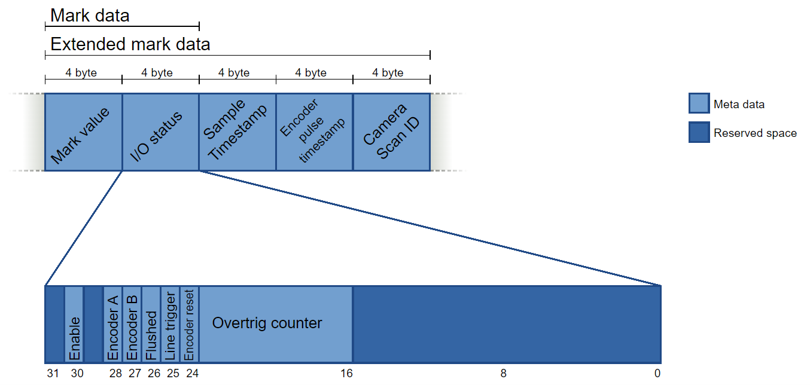
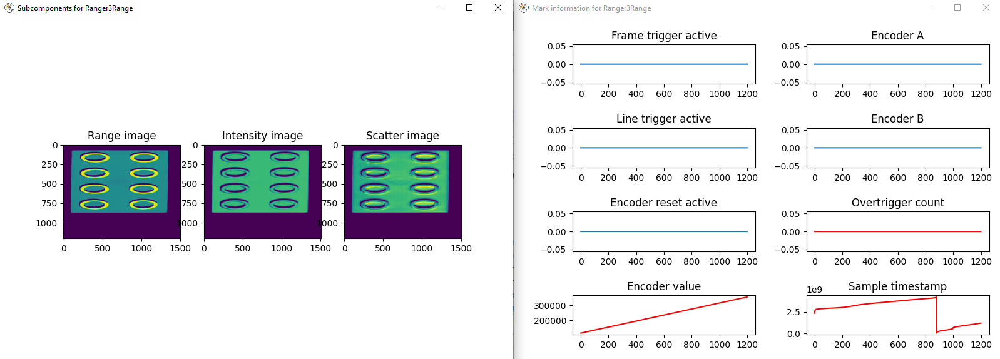
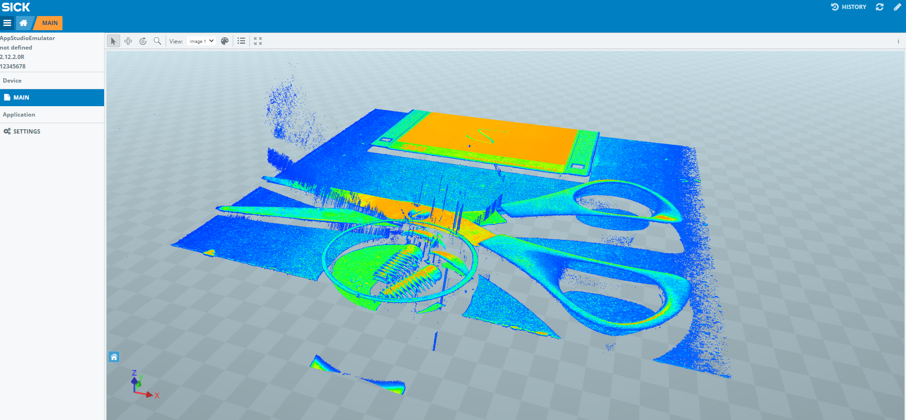

# Icon format

iCon is the file format used when saving frames to disk from Ranger3, Ruler3xxx and RangerE. The format is compatible with Stream Setup, EasyRanger Program Editor and the legacy Ranger3Studio.

An iCon buffer consists of two files - one .dat file, witch contains the data, and one .xml file, which describes the contents and layout of the data. The file format supports both 2D images, and 3D data.


## Data layout

This section describes how the data is represented in the icon file format.

The layout parameter in the XML describes how the data is written in the .dat file. If the layout parameter is SUBCOMPONENT, the data components are written in the .dat file in the same order as given by the order in the XML.

Below is an an example of the XML from an image, with range, reflectance, scatter and metadata.

```xml
<icon_data_format name="" valuetype="">
    <parameter name="size">6036</parameter>
    <parameter name="version">1</parameter>
    <parameter name="layout">SUBCOMPONENT</parameter>
    <component name="Ranger3Range" valuetype="Hi3D">
        <parameter name="size">6036</parameter>
        <parameter name="height">1</parameter>
        <worldrangetraits>
            <parameter name="lower bound x">216.95747375488281</parameter>
            <parameter name="upper bound x">255.07963627018034</parameter>
            <parameter name="lower bound r">136.15886784813483</parameter>
            <parameter name="upper bound r">156.72153567054193</parameter>
            <parameter name="coordinate unit"></parameter>
        </worldrangetraits>
        <genistreamtraits>
            <parameter name="region id">scan 3d extraction 1</parameter>
            <parameter name="extraction method">hi 3d</parameter>
            <parameter name="output mode">rectified c</parameter>
            <parameter name="width">512</parameter>
            <parameter name="height">128</parameter>
            <parameter name="offset X">1216</parameter>
            <parameter name="offset Y">292</parameter>
            <parameter name="a axis range scale">0.025364046916365623</parameter>
            <parameter name="a axis range offset">216.95747375488281</parameter>
            <parameter name="a axis range min">0</parameter>
            <parameter name="a axis range max">1503</parameter>
            <parameter name="a axis range missing">false</parameter>
            <parameter name="a axis range missing value">0</parameter>
            <parameter name="b axis range scale">0.079999998211860657</parameter>
            <parameter name="b axis range offset">0</parameter>
            <parameter name="b axis range min">-inf</parameter>
            <parameter name="b axis range max">inf</parameter>
            <parameter name="b axis range missing">false</parameter>
            <parameter name="b axis range missing value">0</parameter>
            <parameter name="c axis range scale">0.00031377098639495671</parameter>
            <parameter name="c axis range offset">136.15855407714844</parameter>
            <parameter name="c axis range min">1</parameter>
            <parameter name="c axis range max">65535</parameter>
            <parameter name="c axis range missing">true</parameter>
            <parameter name="c axis range missing value">0</parameter>
            <parameter name="unit">millimeter</parameter>
        </genistreamtraits>
        <subcomponent name="Range" valuetype="WORD">
            <parameter name="size">3008</parameter>
            <parameter name="width">1504</parameter>
        </subcomponent>
        <subcomponent name="Intensity" valuetype="BYTE">
            <parameter name="size">1504</parameter>
            <parameter name="width">1504</parameter>
        </subcomponent>
        <subcomponent name="Scatter" valuetype="BYTE">
            <parameter name="size">1504</parameter>
            <parameter name="width">1504</parameter>
        </subcomponent>
        <subcomponent name="Mark" valuetype="INT">
            <parameter name="size">20</parameter>
            <parameter name="width">5</parameter>
        </subcomponent>
    </component>
    <genistream>
        ...
    </genistream>
    <additionalinfo>
        ...
    </additionalinfo>
</icon_data_format>
```

The data is written to the date file in the following order, according to the subcomponent layout:



If the layout parameter is SCAN, the .dat file is written line by line from all subcomponents, like this:


Our software can only load the SCAN layout if the image only has one subcomponent, like in a sensor image. Below is an example of the XML of a 2D sensor image.

```xml
<icon_data_format name="IMAGE" valuetype="IMAGE">
    <parameter name="size">32768</parameter>
    <parameter name="version">1</parameter>
    <parameter name="layout">SCAN</parameter>
    <component name="Ranger3Image" valuetype="image">
        <parameter name="size">2560</parameter>
        <parameter name="height">832</parameter>
        <imagetraits>
            <parameter name="size x">2560</parameter>
            <parameter name="size y">832</parameter>
            <parameter name="offset x">0</parameter>
            <parameter name="offset y">0</parameter>
        </imagetraits>
        <subcomponent name="Image" valuetype="BYTE">
            <parameter name="size">2560</parameter>
            <parameter name="width">2560</parameter>
        </subcomponent>
    </component>
    <genistream>
        ...
    </genistream>
    <additionalinfo>
        ....
    </additionalinfo>
</icon_data_format>
```


## Traits

Each image component has a traits element in the XML which can be used to find out details about the image such as the resolution or bounding values for the data in the buffer.

### Sensor range traits

An uncalibrated image will have a `sensorrangetraits` element in the XML.

The primary use of the sensor image traits is perhaps to find out where on the sensor a certain estimated laser line was. The different camera algorithms typically return an integer value which is the laser position relative to the selected ROI. By using the formula below you can always find the exact sensor position (as a float):

sensor position = algorithm result * scale + origin

The sensor image traits contains the scale and origin for both range and x position. 

The sensor range traits can also tell the max and min values the algorithm can return in both X and Z. The four points (X0, Z0), (X1, Z1), (X2, Z2), (X3, Z3) define a bounding box around valid values. Note: Missing data (which indicates that no laser line was found in this column) is always represented by 0 which is always outside this bounding box.

### World range traits

A calibrated image will have a `worldrangetraits` element in the XML World range traits contains the bounding box for calibrated data in real world units. The bounding box is defined by lower and upper bound for x and z.

When the image is calibrated you define its rectification width, which is the number of pixels used in the rectification. You can find out the X resolution (horizontal distance between two adjacent pixels) of the buffer using the following formula:

X resolution = (upper bound x - lower bound x) / rectification width

### GenIStream traits

GenIStream traits contain addition information, for example the width, height, y-resolution of the image components. It also tells if the image is calibrated or not. 


## Metadata

In iCon buffers, metadata is available per line and is called *mark* data. It is represented as a subcomponent with name `"MARK"` and type `"INT"`. There are two types of mark data:

- Standard mark data: 8 bytes
- Extended mark data: 20 bytes

The contents of the metadata are:

- **Mark value***:* encoder value (Ranger3: `ChunkEncoderValue`)

- I/O status:

  - *Enable:* Frame trigger high (Ranger3: `ChunkFrameTriggerActive`)
  - *Encoder A:* Encoder input channel A
  - *Encoder B:* Encoder input channel B
  - *Flushed (RangerE only):* Indicates that this line was flushed from the device, that is the frame was completed early. This line is an extra line with mark data only, for the end of the frame. It is used to signal `Enable = 0`
  - *Line trigger active (Ranger3 only)*: 
  - *Encoder reset active (Ranger3 only)*: 
  - *Overtrig:* The number of discarded trigger signals received between this line and the previous (Ranger3: `OvertriggerCount`)

- **Sample timestamp**

- **Encoder pulse time stamp (RangerE only)**

- **Camera scan ID (RangerE only)**

  




## Python iCon Reader

The attached iConReader.zip contains a python script that can load iCon files from disk.

It also contains three examples using the iConReader to: 

* Load and convert iCon images to .ply.

* Load and plot the image components and mark data of an iCon image.

  

  

  

* Load and convert iCon images to AppSpace compatible .json.  




Download the code and install the dependencies to be able to run the examples with python, as described in the included readme. 


